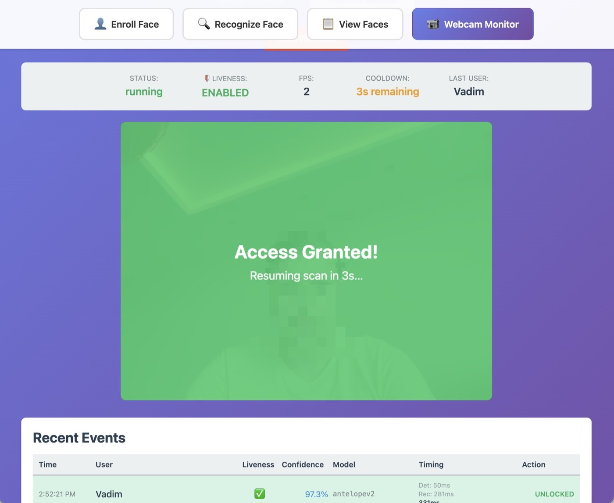
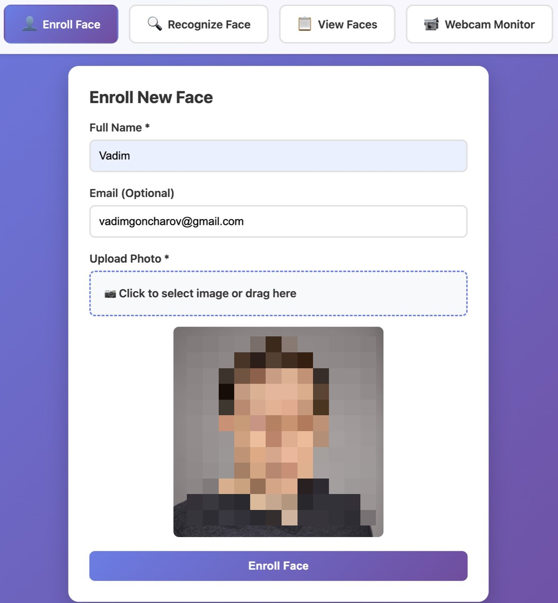
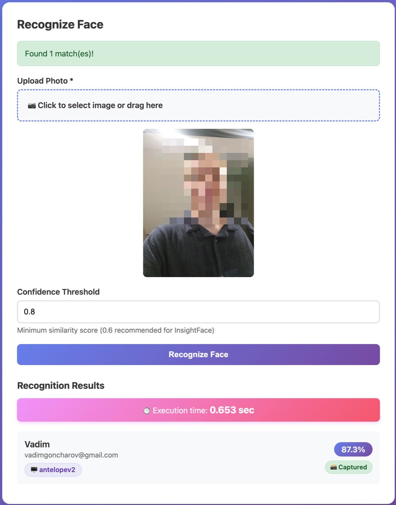
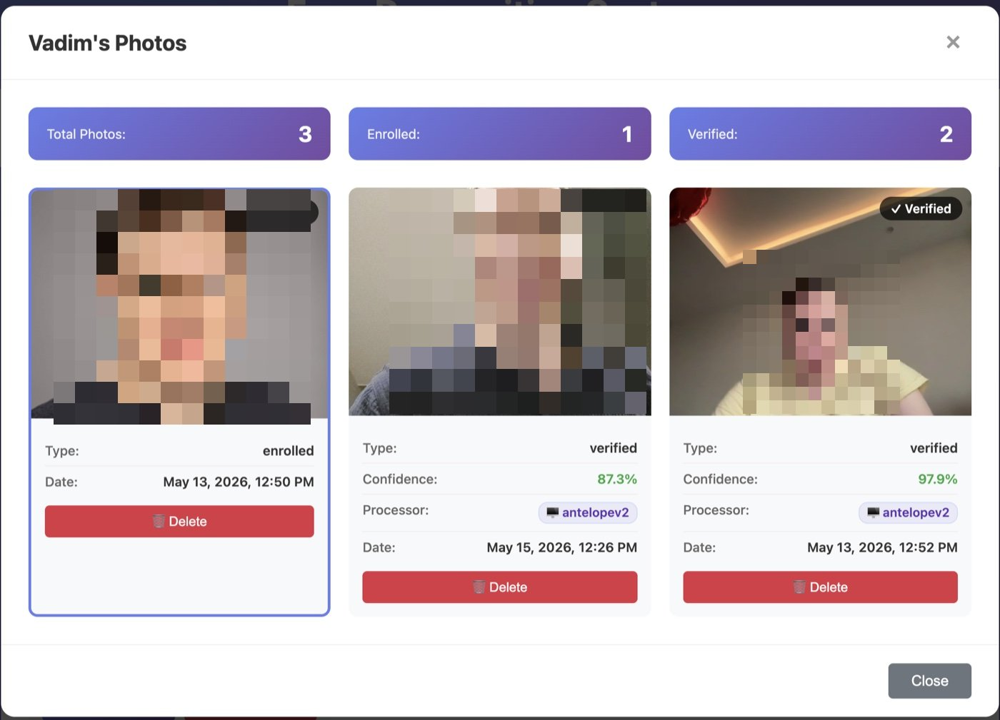
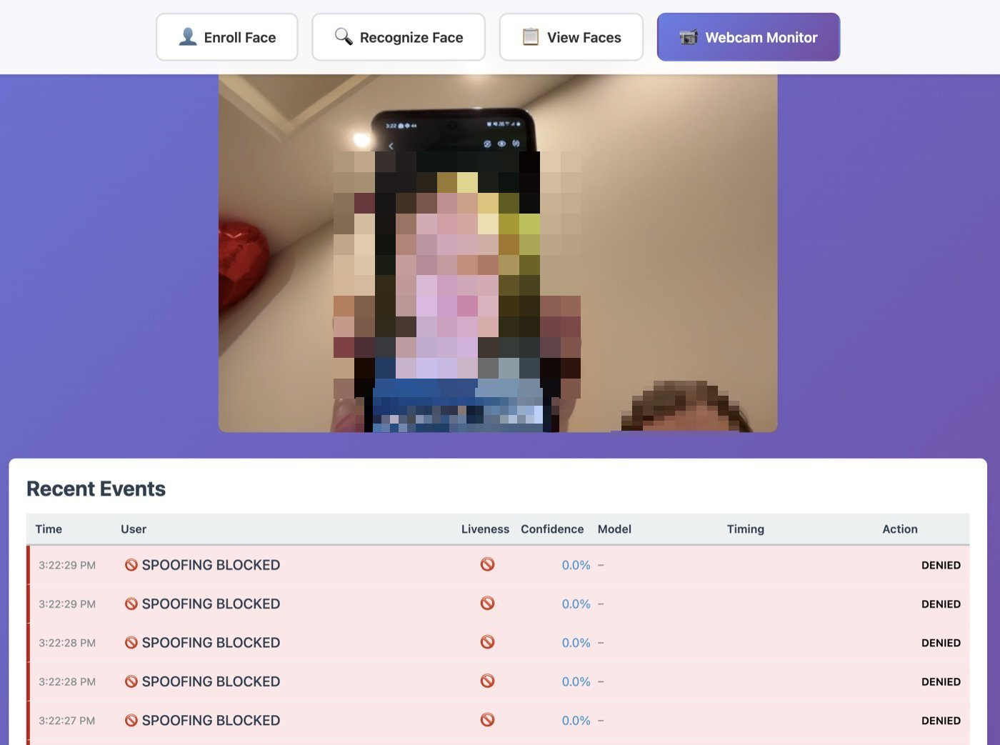
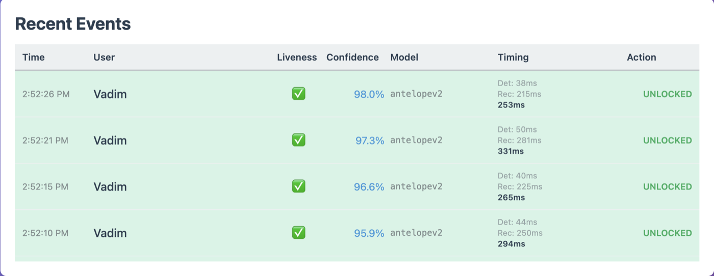

# FaceGuard

[](LICENSE)
[](https://python.org)
[](tests/)
[](tests/)

**FaceGuard** is a self-hosted face recognition platform: enroll people through a web UI or REST API, recognize them in photos or live webcam streams, and fire a pluggable trigger on every confident match — an HTTP call to any of your systems, a Raspberry Pi GPIO pin, or just a log entry. Door access control is the bundled example of such a trigger, but anything reachable over HTTP works. Recognition runs **locally by default** (InsightFace, no cloud, no per-request costs), with an optional hybrid mode that escalates low-confidence matches to AWS Rekognition. Passive **liveness detection** (Silent-Face anti-spoofing) blocks photo/screen replay attacks.

<p align="center">
  
</p>

> **Privacy notice:** this software processes biometric data. Review [Ethical Use](#ethical-use) and applicable laws (GDPR, BIPA, CCPA) before deploying.

## Features

- **Face enrollment & recognition** — REST API + Vue 3 web UI; embeddings stored in PostgreSQL with pgvector (HNSW index, cosine similarity)
- **Three recognition modes** — `local` (default, fully on-device), `hybrid` (local + cloud verification in the grey zone), `cloud` (AWS Rekognition)
- **Liveness / anti-spoofing** — passive Silent-Face (MiniFASNet ensemble) on enrollment, recognition, and webcam streams; spoof attempts are logged and denied
- **Webcam monitoring with on-match triggers** — browser mode for testing, headless daemon for production; a confident match fires a pluggable action (HTTP webhook / Raspberry Pi GPIO / mock — door unlock is the bundled example); structured JSON access logs (ELK/Loki-ready)
- **Multi-face recognition** — Haar / DNN / InsightFace detectors, optional region-of-interest filtering for entrance cameras
- **Auto-capture & template averaging** — high-confidence sightings are saved as extra "verified" photos (FIFO per user) and averaged into the user's template, improving accuracy over time
- **Two-layer security** — Traefik Basic Auth at the edge + constant-time `x-face-token` check in the app; HTTPS via Let's Encrypt
- **Storage abstraction** — images on local disk or S3; Redis caches embeddings and liveness results

## Screenshots

| | |
|---|---|
|  |  |
| *Enrollment — upload a photo, get a quality-checked template* | *Recognition — match with similarity, processor and timing* |
|  |  |
| *Per-user gallery — enrolled + auto-captured verified photos* | *Anti-spoofing — a phone-screen replay is detected and denied* |

<p align="center">
  
</p>
<p align="center"><i>Live access log — ~40 ms detection + ~250 ms recognition per frame on CPU</i></p>

## Architecture

```
                        ┌──────────────────────────────┐
                        │     Traefik  :80 / :443      │
                        │  TLS (Let's Encrypt) + Basic │
                        │          Auth                │
                        └──────┬──────────────┬────────┘
                               │ /            │ /api /docs /health
                        ┌──────▼─────┐  ┌─────▼──────────────┐
                        │  Vue 3 SPA │  │      FastAPI       │
                        │   (web)    │─▶│  x-face-token auth │
                        └────────────┘  └─┬─────┬─────┬──────┘
                                          │     │     │
                            ┌─────────────▼┐ ┌──▼───┐ ┌▼──────────────────┐
                            │  PostgreSQL  │ │Redis │ │ InsightFace (CPU/ │
                            │  + pgvector  │ │cache │ │ GPU) + Silent-Face│
                            └──────────────┘ └──────┘ │     liveness      │
                                                      └───────┬───────────┘
                 ┌──────────────┐   ┌──────────────────┐      │ optional fallback
                 │ Webcam daemon│──▶│ On-match trigger │  ┌───▼─────────────┐
                 │ (host/Docker)│   │ HTTP/GPIO/mock   │  │ AWS Rekognition │
                 └──────────────┘   └──────────────────┘  └─────────────────┘
```

### Recognition modes (`RECOGNITION_MODE`)

| Mode | How it works | AWS account |
|---|---|---|
| `local` | pgvector search + template averaging, fully local (default) | not needed |
| `hybrid` | similarity ≥ 0.8 → trust local; 0.6–0.8 → verify with AWS `CompareFaces` against the stored image; < 0.6 → reject. Cuts AWS calls by an order of magnitude vs. `cloud`; does not index into AWS collections on enroll | optional |
| `cloud` | everything through AWS Rekognition collections (enroll indexes, recognize searches) | required |

*Legacy aliases still work as deprecated settings: `insightface_only`→`local`, `smart_hybrid`/`insightface_aws`→`hybrid`, `aws_only`→`cloud` (via `FACE_PROVIDER`/`USE_HYBRID_RECOGNITION`/`HYBRID_MODE`).*

## Quick Start

Requires Docker 20.10+ and Docker Compose 2.0+ (4 GB RAM recommended).

```bash
git clone https://github.com/vadimgodev/face-recognition.git faceguard
cd faceguard
cp .env.example .env
```

Edit `.env` and set at least:

```bash
BASIC_AUTH_USERNAME=admin            # browser login
BASIC_AUTH_PASSWORD=<strong-password>
SECRET_KEY=<random-32-char-string>   # API token (x-face-token header)
VITE_API_TOKEN=<same-as-SECRET_KEY>  # lets the web UI call the API
POSTGRES_PASSWORD=<db-password>
REDIS_PASSWORD=<redis-password>
RECOGNITION_MODE=local               # fully local — no AWS account needed
```

Then start everything:

```bash
docker compose up -d
```

The first start downloads InsightFace models (~350 MB, 1–2 minutes). Open **http://localhost**, log in with your Basic Auth credentials — that's it. Interactive API docs live at http://localhost/docs.

Runs fully local out of the box (`local`); no AWS account needed. To use a real domain with HTTPS, set `DOMAIN` and `ACME_EMAIL` — see [docs/deployment.md](docs/deployment.md).

## API

Every endpoint needs Basic Auth (Traefik). Endpoints marked **token** additionally need the `x-face-token: $SECRET_KEY` header. Image and stream endpoints are token-exempt so `` tags and `EventSource` work.

| Method | Endpoint | Auth | Description |
|---|---|---|---|
| POST | `/api/v1/faces/enroll` | token | Enroll a face (multipart `image`, `user_name`, optional `user_email`) |
| POST | `/api/v1/faces/recognize` | token | Recognize a single face |
| POST | `/api/v1/faces/recognize-multiple` | token | Recognize all faces in a frame (optional ROI filter) |
| POST | `/api/v1/faces/liveness/check` | token | Standalone liveness / anti-spoofing check |
| GET | `/api/v1/faces` | token | List faces (`limit`, `offset`) |
| GET | `/api/v1/faces/{id}` | token | Get face by ID |
| GET | `/api/v1/faces/{id}/image` | basic | Face image (JPEG) |
| GET | `/api/v1/faces/user/{name}/photos` | token | All photos of a user (enrolled + verified) |
| DELETE | `/api/v1/faces/{id}` | token | Delete face (provider + storage + DB) |
| POST | `/api/v1/webcam/start` / `stop` | token | Start/stop server-side webcam capture |
| GET | `/api/v1/webcam/status` | token | Webcam capture state |
| GET | `/api/v1/webcam/stream` | basic | Live SSE preview stream |
| GET | `/health`, `/` | basic | Health / service info |

### Enroll

```bash
curl -X POST http://localhost/api/v1/faces/enroll \
  -u admin:password -H "x-face-token: $SECRET_KEY" \
  -F "image=@photo.jpg" -F "user_name=John Doe" -F "user_email=john@example.com"
```

```json
{
  "success": true,
  "message": "Face enrolled successfully",
  "face": {
    "id": 1,
    "user_name": "John Doe",
    "user_email": "john@example.com",
    "provider_name": "insightface",
    "photo_type": "enrolled",
    "quality_score": 0.94,
    "created_at": "2026-07-23T12:00:00Z"
  }
}
```

*(face object trimmed; see `/docs` for the full schema — IDs are integers)*

### Recognize

```bash
curl -X POST http://localhost/api/v1/faces/recognize \
  -u admin:password -H "x-face-token: $SECRET_KEY" \
  -F "image=@unknown.jpg" -F "confidence_threshold=0.6"
```

```json
{
  "success": true,
  "message": "Found 1 match(es)",
  "matches": [
    {
      "face": { "id": 1, "user_name": "John Doe", "photo_type": "enrolled" },
      "similarity": 0.92,
      "photo_captured": true,
      "processor": "antelopev2"
    }
  ],
  "total_matches": 1,
  "processor": "antelopev2",
  "execution_time": 0.65,
  "detection_time": null,
  "recognition_time": null
}
```

`photo_captured: true` means the shot was confident enough (≥ 0.85 by default) to be auto-saved as a verified photo and folded into the user's averaged template. `detection_time`/`recognition_time` are only populated by `/recognize-multiple`, which measures each stage separately; single-face `/recognize` reports just `execution_time`. More examples: [rest-api.http](rest-api.http).

## Webcam Monitoring & Triggers

Two ways to run continuous recognition:

- **Browser mode** (development) — open **Webcam Monitor** in the UI: frames from your camera go through liveness + recognition at ~2 FPS with a cooldown after each success.
- **Daemon mode** (production) — headless loop with the same pipeline plus an on-match trigger and JSON access logging:

```bash
python webcam_daemon.py --camera 0 --mode daemon
```

On Linux the daemon can run inside Docker with camera passthrough: `docker compose -f docker-compose.yaml -f docker-compose.webcam.yaml up -d`. On macOS/Windows run it on the host (Docker Desktop can't access cameras).

When a match clears the confidence threshold, FaceGuard fires the trigger configured by `TRIGGER_PROVIDER`: `webhook` POSTs the match as JSON to any endpoint you point it at (`TRIGGER_WEBHOOK_URL`) — a door controller is the classic case, but a smart-home hub, alarm system, or notification service works the same way; `gpio` pulses a Raspberry Pi relay pin; `log` just logs (default). Door access is an example of what recognition can drive, not the product itself — the platform's job is answering "who is this?" fast and reliably.

Every recognition emits a structured access event:

```json
{"timestamp": "2026-07-23T12:36:32Z", "event_type": "face_recognition", "result": "success",
 "user_name": "John Doe", "confidence": 0.9192, "processor": "antelopev2",
 "trigger_action": "fired", "execution_time_ms": 796, "camera_id": 0}
```

## Configuration

Everything is configured through `.env` — [`.env.example`](.env.example) documents every variable. The most important ones:

| Variable | Default | Purpose |
|---|---|---|
| `RECOGNITION_MODE` | `local` | Recognition mode (see table above) |
| `INSIGHTFACE_MODEL` | `antelopev2` (Docker) | Model pack; `buffalo_l` is a lighter alternative |
| `INSIGHTFACE_DET_SIZE` | `640` | Detection resolution: 320 fast / 640 balanced / 1024 accurate |
| `SIMILARITY_THRESHOLD` | `0.6` | Minimum similarity to count as a match |
| `LIVENESS_ENABLED` | `false` | Enable Silent-Face anti-spoofing |
| `LIVENESS_ON_RECOGNITION` | `false` | Also require liveness on every recognition |
| `AUTO_CAPTURE_ENABLED` | `true` | Save high-confidence sightings as verified photos |
| `MULTIFACE_ENABLED` | `false` | Allow multiple faces per frame |
| `WEBCAM_ENABLED` | `false` | Enable server-side webcam capture |
| `TRIGGER_PROVIDER` | `log` | On-match trigger: `log` / `webhook` (any URL) / `gpio` |
| `STORAGE_BACKEND` | `local` | `local` or `s3` |
| `INSIGHTFACE_CTX_ID` | `-1` | `-1` CPU, `0+` GPU device (see [GPU notes](docs/deployment.md#gpu)) |

Full reference: [docs/configuration.md](docs/configuration.md)

## Development

```bash
python3.13 -m venv .venv && source .venv/bin/activate
pip install -r requirements-dev.txt
cp .env.example .env                      # set POSTGRES_HOST=localhost, REDIS_HOST=localhost
docker compose up -d postgres redis
alembic upgrade head
uvicorn src.main:app --reload             # backend on :8000

cd web && npm install && npm run dev      # frontend on :3000
```

```bash
pytest                                    # 545 tests, no Docker required (fully mocked)
black . && ruff check . && mypy src/      # quality gates
```

> **Python 3.13 note:** torch needs a one-line patch on Python 3.13 (applied automatically in Docker and CI). If local imports of torch fail, see [docs/troubleshooting.md](docs/troubleshooting.md#torch-on-python-313).

Adding a provider or trigger: [docs/extending.md](docs/extending.md).

### Project layout

```
src/            FastAPI backend
├── api/        routes/ package (faces, recognition, liveness, webcam) + deps + schemas
├── services/   FaceService (single entry), recognition strategies, webcam, auto-capture
├── triggers/   on-match triggers: log / webhook / gpio + TriggerService
├── providers/  registry + interfaces; InsightFace, AWS Rekognition, Silent-Face liveness
├── database/   SQLAlchemy models + repository (pgvector search)
├── storage/    local / S3 backends (PyFilesystem2)
├── antispoof/  vendored Silent-Face MiniFASNet models
└── middleware/ x-face-token auth
web/            Vue 3 SPA (enroll / recognize / gallery / webcam monitor)
webcam_daemon.py  standalone recognition daemon
alembic/        DB migrations · tests/ 545 tests · docs/ guides
```

More: [docs/deployment.md](docs/deployment.md) · [docs/configuration.md](docs/configuration.md) · [docs/troubleshooting.md](docs/troubleshooting.md) · [CONTRIBUTING.md](CONTRIBUTING.md) · [SECURITY.md](SECURITY.md)

## Ethical Use

FaceGuard processes biometric data. If you deploy it, you are responsible for:

- obtaining informed consent from everyone whose face is enrolled or scanned;
- complying with biometric privacy laws (GDPR, BIPA, CCPA, …) including retention and deletion policies;
- not using it for mass surveillance or discrimination;
- treating liveness detection as one safeguard, not a guarantee — it is passive (single-image) and should not be the only control for high-security access.

## License

MIT — see [LICENSE](LICENSE). Third-party model weights (InsightFace, Silent-Face-Anti-Spoofing) carry their own licenses; verify before commercial use.

## Acknowledgments

[InsightFace](https://github.com/deepinsight/insightface) · [Silent-Face-Anti-Spoofing](https://github.com/minivision-ai/Silent-Face-Anti-Spoofing) · [FastAPI](https://fastapi.tiangolo.com) · [Vue.js](https://vuejs.org) · [pgvector](https://github.com/pgvector/pgvector) · [Traefik](https://traefik.io)
